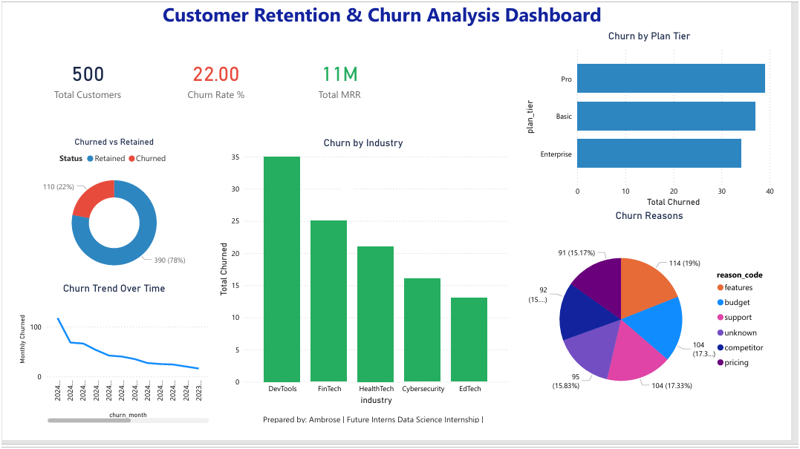

# FUTURE_DS_02 — Customer Retention & Churn Analysis

## 📌 Project Overview
This project was completed as part of the **Future Interns Data Science & Analytics Internship (2026) — Task 2**.

The goal was to analyse customer subscription data for a SaaS business to understand churn patterns, identify retention drivers, and provide actionable recommendations to reduce customer loss.

---

## 🛠️ Tools Used
- **Microsoft Excel** — Data cleaning & preparation
- **Power BI** — Dashboard creation & DAX measures

---

## 📁 Dataset
**Source:** Rivalytics SaaS Subscription & Churn Analytics Dataset (Kaggle)

**Files used:**
- ravenstack_accounts — 500 customer records
- ravenstack_subscriptions — 5,000 subscription records
- ravenstack_churn_events — 600 churn records
- ravenstack_support_tickets — 2,000 support records
- ravenstack_feature_usage — 25,000 usage records

---

## 📊 Dashboard Visuals
| Visual | Insight |
|---|---|
| KPI Cards | 500 customers, 22% churn rate, 11M total MRR |
| Donut Chart | 110 churned (22%) vs 390 retained (78%) |
| Bar Chart | Pro plan has highest churn |
| Column Chart | DevTools industry churns the most |
| Line Chart | Churn declining over 2024 |
| Pie Chart | Features (19%) is #1 churn reason |

---

## 🔍 Key Insights
1. **22% churn rate** — 110 out of 500 customers lost
2. **Pro plan** customers churn the most — pricing may not match perceived value
3. **DevTools industry** has the highest churn — 35 customers lost
4. **Features (19%)** is the top churn reason — product gaps need addressing
5. **Churn is declining** over 2024 — retention efforts are working

---

## 💡 Recommendations
1. **Review Pro plan pricing** — offer flexible billing or discounts for at-risk customers
2. **Invest in product features** — 19% left due to missing features; conduct user feedback sessions
3. **Target DevTools segment** — create tailored onboarding and retention campaigns
4. **Monitor early churn** — customers leaving in first 90 days need better onboarding
5. **Leverage declining trend** — identify what changed in mid-2024 and scale it

---

## 📸 Dashboard Preview

---

## 👤 Author
**Ambrose**
Future Interns Data Science & Analytics Internship
Track: DS | Task 2 | 2026
